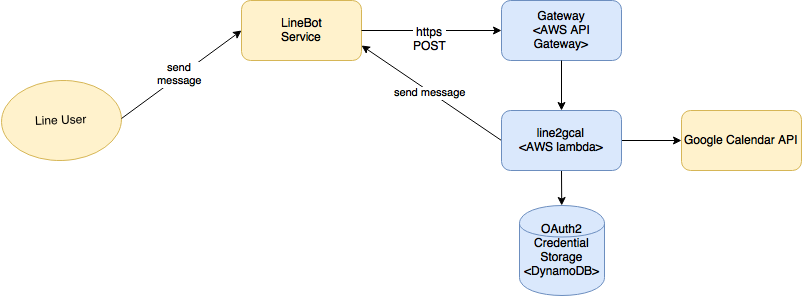

# line2gcal

## Deployment

## setup
- setup google api account, download client_secret.json
- run the init command to approve api in the code
- pack, change mode for credentials

## deploy on AWS use Lambda + API Gateway
- pack the code

## commands
/gcal 'Analysis of Algorithms Final' 12/24

[Required]
title
start date

[Optional]
w=UCI 
duration=60
description='It is going to be hard!' 
reminder=30 
who='boss@example.com'

